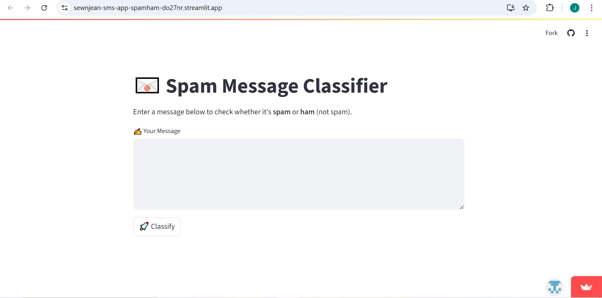

# 📧 Spam Message Classifier

A simple and interactive web app built with Streamlit that classifies text messages as **Spam** or **Ham** using a Naive Bayes model.

## 📊 Model Accuracy

- Algorithm: Multinomial Naive Bayes  
- Test Size: 30%  
- Accuracy: ~98.2%

## 📁 Dataset

- Dataset: [SMS Spam Collection Dataset](https://www.kaggle.com/datasets/uciml/sms-spam-collection-dataset)  
- Filename: `spam.csv`

## ✨ Features

- Trained with `CountVectorizer` and `MultinomialNB`
- Accuracy: ~98.2%

## 🛠️ Instructions
1. On vs code terminal, download streamlit reqs (pip install streamlit)
2. Create repo on github
3. On vscode, create a folder, also copy paste the code to create frontend/ prompt a frontend, or the app.py
4. On vscode add the spam.csv
5. On vscode add the requirements, on terminal type "pip freeze > requirements.txt
6. Run the app "streamlit run app.py"
7. Then deploy the app into streamlit

